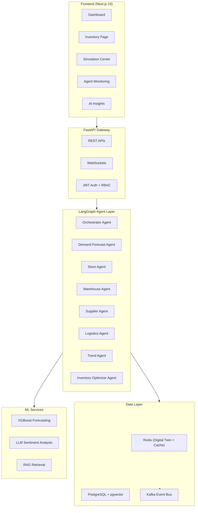

# 🌊 OmniFlow AI — System Architecture

This document describes the high-level architecture of the **OmniFlow AI** Multi-Agent Supply Chain Digital Twin.

---

## 🏗️ Core Layers

### 1. LangGraph Multi-Agent Layer
The intelligence of OmniFlow AI is driven by a cooperative multi-agent graph constructed using **LangGraph**:
- **Orchestrator**: Manages state transitions, triggers specialized agents, compiles decisions, and resolves inventory distribution conflicts.
- **Demand Forecast Agent**: Analyzes purchase velocity and triggers warning thresholds when demand shifts.
- **Store Agent**: Acts as store manager, generating regional restock requests when shelf quantities degrade.
- **Warehouse Agent**: Receives store restock requests, checks warehouse stock, and schedules distribution shipments.
- **Supplier Agent**: Monitors supplier capacity levels and triggers delays or alternative sourcing.
- **Logistics Agent**: Computes pathfinding routing options, estimates ETAs, and calculates CO2 emissions.
- **Trend Agent**: Captures social sentiment spikes using textual keyword intensity.
- **Optimizer Agent**: Recalculates dynamic safety stock levels based on a 98% target service level.

### 2. Digital Twin (Redis + PostgreSQL)
- **Redis Cache**: Holds the real-time cache of all inventory points to guarantee sub-millisecond status updates. Supports isolated snapshots and rollbacks, allowing users to trigger disruptions in "Simulation Mode" without modifying the actual live production numbers.
- **PostgreSQL**: Records the transactional entities, user accounts, shipment histories, and recommendations.

### 3. Machine Learning (XGBoost)
- Trains historical sales timelines against date features (weekdays, months), category weights, and promotion schedules to generate accurate 7/30-day demand predictions.
